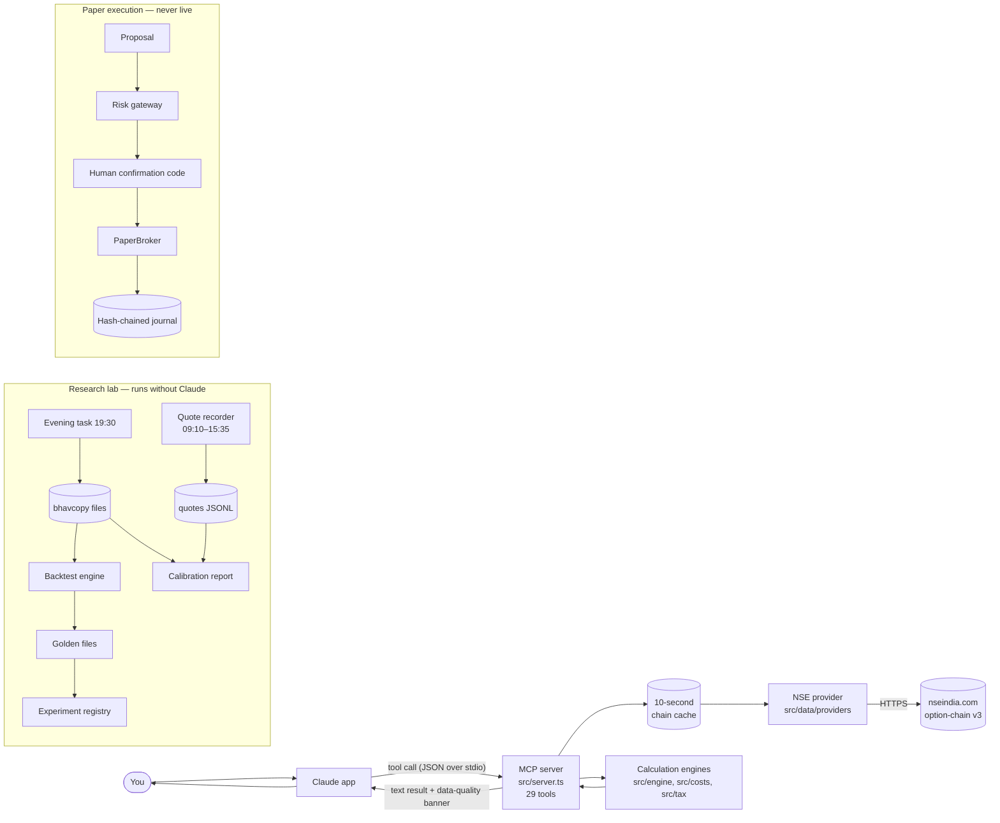

# Pradyumna's User Guide / System Map

*Plain-English guide to everything in this repository: what each part is, how a request moves
through it, what has and has not been proven, and where a wrong trading decision could still come
from. Written 2026-10-04 on branch `audit/foundation`. Not investment advice.*

---

## Part 1 — The ten questions, answered briefly

| # | Question | Short answer |
|---|---|---|
| 1 | **What did we build?** | An options **research and analysis** system for NSE F&O. It has three parts: (a) an MCP server that gives Claude 29 analysis tools (option chains, Greeks, payoffs, costs, tax); (b) a research lab (historical data, a backtest engine, cost and tax models, an experiment registry, independent verification); (c) a **paper-only** execution path guarded by a risk gateway. |
| 2 | **Why?** | To answer "does this options idea make money **after all Indian costs**?" with evidence, before any money is at risk, and to make "no trade" the default answer whenever the evidence is weak. |
| 3 | **What real-world problem does it solve?** | Most retail options analysis shows gross P&L, ignores costs and spreads, and trusts a backtest nobody checked. This system counts every rupee of cost (brokerage, STT, exchange, SEBI, stamp, GST, bid-ask spread), reconciles costs to real contract notes, freezes and verifies backtests, and records every experiment, so self-deception is hard. |
| 4 | **What data does it use?** | NSE's official end-of-day **bhavcopy** files (every F&O contract, every day since July 2024); **live option-chain snapshots** from NSE's public website (being recorded from 5 Oct 2026); your **own Zerodha contract notes** (kept outside the repo) for cost checks; NSE circulars for holidays; broker and statute pages for charges. |
| 5 | **What assumptions does it make?** | Fills at the next day's close ± a pessimistic spread (not yet calibrated). NSE charge rates as published. Margin from a rough proxy. Black-Scholes for Greeks and probabilities. One lot, no compounding. Full list in Part 6. |
| 6 | **What tests prove it works?** | 253 automated tests. Three frozen backtest results that reproduce to the paisa. An **independent Python re-implementation** that matches all 104 trades. A data audit of 18.5 million rows. Charges matching 41 real contract notes (₹8,624.23 modelled vs ₹8,624.25 actual). CI on GitHub for every commit. |
| 7 | **What has NOT been proven?** | That **any** strategy makes money (the only one tested lost). That the spread assumption is right. Charges after April 2026 and at expiry, which have not been seen on a contract note. Real broker margin. Intraday behaviour. Anything live. |
| 8 | **What could still produce a wrong decision?** | Stale or changed NSE data (an endpoint broke on 4 Oct and was fixed), heuristic tools (margin, probability) read as facts, Claude mis-explaining a tool result, small samples, the uncalibrated spread, and tuning ideas to past data. Part 7 has the full list. |
| 9 | **What money/risk could be affected?** | **None today**: no code path can place a real order. Risk appears only when **you** act on an analysis manually. For scale, the reference strategy (1 lot) lost up to ₹17,807 in one week, needed about ₹1.3 lakh of capital to survive its drawdown, and lost ₹61,313 over two years after costs. |
| 10 | **What decision should I make next?** | Nothing to trade. Let the quote recorder collect about 20 sessions (about 4 weeks). Check it tomorrow morning. Give the Zerodha basket-margin figure for one iron condor when convenient. Decide later whether a tiny real trade is worth it to verify post-April charges. Part 9 has details. |

---

## Part 2 — The big picture

There are **three separate ways** to use this system. They share the same cost and data code, but
they are different journeys:

```
 A. ASKING CLAUDE (analysis)      You ─▶ Claude ─▶ MCP server ─▶ NSE live data ─▶ calculation ─▶ answer
 B. RESEARCH (evidence)           Scheduled tasks / CLI ─▶ NSE files ─▶ backtest ─▶ verified report ─▶ registry
 C. PAPER EXECUTION (rehearsal)   Proposal ─▶ Risk gateway ─▶ human code ─▶ PaperBroker (simulated) ─▶ journal
                                  (Live execution: does not exist. TRADING_MODE=live crashes on purpose.)
```

The governing rule, built into the code: **Claude may analyse and propose. Deterministic software
must validate. A risk gateway must approve. Only the execution engine may submit an order, and today
that order can only go to the paper broker.**



---

## Part 3 — Journey A: exactly how one question travels

**Example question:** *"What is the max loss of a NIFTY iron condor: buy 24250 PE, sell 24500 PE,
sell 25500 CE, buy 25750 CE, this week's expiry?"*

| Step | Where | What happens, in plain English |
|---|---|---|
| 1 | **You → Claude** | You type the question in the Claude app. |
| 2 | **Claude decides** | Claude reads the list of tools this MCP server advertises and their descriptions. It picks one, here `custom_strategy`, and writes its arguments as JSON (symbol, legs, expiry). **This is the only "AI" step.** Everything after it is ordinary, deterministic code. |
| 3 | **Claude → MCP server** | The Claude app started this server as a local program (`node dist/bundle.mjs`) and talks to it over **stdio** (text pipes). Nothing goes to the internet at this step. |
| 4 | **Input check** | `src/server.ts` validates every argument with **zod** schemas: symbol format, strike > 0, quantity a whole number, expiry a real date, and so on. Bad input is rejected with an error and never reaches a calculation. |
| 5 | **Cache** | `getChain()` checks a **10-second in-memory cache**. If the same chain was fetched in the last 10 s, it is reused, so NSE is not hammered. |
| 6 | **Data fetch** | `src/data/providers/nse.provider.ts` fetches from NSE's website: first the list of expiries (`option-chain-contract-info`, cached 15 min), then the chain for the chosen expiry (`option-chain-v3`). It handles NSE cookies, retries and rate limiting. If v3 fails, it falls back to a poorer endpoint and marks the data **DEGRADED** (no bid/ask, no IV). If both fail, it **errors** rather than guess. |
| 7 | **Clean-up** | The raw NSE JSON is mapped into one standard shape, for **one expiry only**. Any field NSE reports as 0 meaning "no quote" (price, IV, bid, ask) becomes `null`, which prints as `n/a`, **never as 0**. That rule exists because a fake 0 premium once made a strategy look free. |
| 8 | **Freshness verdict** | `src/data/quality.ts` labels the data **FULL / DEGRADED / STALE / UNAVAILABLE** from its source timestamp. During market hours, data older than 120 s is STALE. |
| 9 | **Pricing the legs** | The tool looks up each leg's last price and bid/ask in the chain. If any leg has no price, it **refuses** instead of inventing one. The lot size comes from the NSE bhavcopy history for that contract and date (`src/data/constants/lot-sizes.ts`). |
| 10 | **Calculation** | `src/engine/payoff.ts` computes the expiry payoff: **gross** max profit, max loss and breakevens, exact and not sampled. A naked short is reported as **unlimited** loss. `src/costs/transaction-cost-engine.ts` adds brokerage, STT, exchange, SEBI, stamp duty and GST from the charge schedule in force on the trade date, giving a **net** result. |
| 11 | **Result → Claude** | The tool returns **plain text**: the numbers, the data-quality banner, the source timestamp and warnings. |
| 12 | **Claude → You** | Claude explains the result. **Trust the tool's numbers, not Claude's paraphrase.** If Claude does arithmetic of its own, or answers without calling a tool, that part is not verified. Ask it to show the tool output. |

Which tools are **live-data** and which are **pure maths**:

| Kind | Tools | Needs NSE? |
|---|---|---|
| Market data | `get_option_chain`, `get_expiry_dates`, `get_spot_price`, `market_overview` | Yes |
| Positioning statistics (descriptive, **no proven predictive value**) | `get_pcr`, `calculate_max_pain`, `highest_oi_strikes`, `oi_change_analysis`, `scan_high_oi`, `unusual_activity`, `iv_smile`, `expected_move` | Yes |
| Strategy P&L | `build_strategy`, `custom_strategy` (live prices); `calculate_payoff` (your prices) | First two yes |
| Option maths (Black-Scholes model) | `calculate_greeks`, `calculate_iv`, `calculate_option_price`, `what_if_greeks`, `probability_of_profit` | No |
| Costs and tax | `estimate_transaction_costs`, `estimate_tax` | No |
| Sizing and margin | `position_sizing`; `estimate_margin` (**rough heuristic, understates short straddles; do not rely on it**) | Margin yes |
| Calendar | `market_status`, `next_expiry` (computed; prefer `get_expiry_dates`), `lot_size` | No |
| Templates | `suggest_strategy`, `list_strategies` (**textbook shapes, not recommendations**) | No |

**No MCP tool can place an order, change trading mode or reach the paper broker.**

---

## Part 4 — Journey B: research (no Claude involved)

This is where evidence comes from. It runs from scheduled tasks and command-line tools.

```
Daily (automatic)
  09:10 IST  Task "Options HQ Quote Recorder" ─▶ src/cli/record-quotes.ts
             every 60 s until 15:35: NIFTY + BANKNIFTY chains (ATM ±10 strikes, 2 expiries)
             ─▶ ~/.options-hq/data/quotes/nse-fo/<date>_<symbol>.jsonl  (FULL-quality rows only)
  19:30 IST  Task "Options HQ Evening Calibration" ─▶ run-evening.cmd
             ├─ bhavcopy-cli --last 7   (download NSE end-of-day files; stored days reused)
             └─ calibration-cli         (readiness + close-vs-quote report)
             ─▶ ~/.options-hq/data/calibration/calibration-report.md

On demand (you or me)
  backtest-cli ─▶ eod-engine ─▶ cost engine + PnL engine ─▶ report (gross / costs / NET)
               ─▶ golden file (frozen per-trade result) ─▶ experiment registry entry
  verify_reference.py ─▶ independent re-computation from raw NSE zips (must match to the paisa)
```

What the **backtest engine** (`src/backtest/eod-engine.ts`) does on each trading day:

1. Loads that day's bhavcopy, all contracts and all prices, as published by NSE after the close.
2. **Fills any order decided the evening before** at today's close, plus a pessimistic half-spread
   against you, rounded to the 5-paise tick. A contract that didn't trade means the trade is skipped
   and logged. Muhurat special sessions are not fill days.
3. **Follows every held contract by NSE's instrument ID**. If NSE relabels the expiry, it follows it;
   if a contract vanishes, it stops with an error.
4. **Settles** positions on expiry day at NSE's official settlement price, including exercise STT
   and settlement brokerage.
5. In the evening, gives the strategy **only today's data**, which makes look-ahead impossible. The
   strategy proposes a trade, or says why not.
6. Refuses to run if a trading day is missing, or if a position would survive past its expiry.

Then:
- `report.ts` produces **gross, costs and NET**, win rate *with* average win and loss, drawdown, a
  development vs out-of-sample split, and cost stress tests.
- `golden.ts` freezes the result.
- `data-version.ts` fingerprints the exact data files used.
- The **experiment registry** (`research/experiments.jsonl`) records every run, hash-chained so past
  entries can't be quietly edited. New ideas must be **registered before they run** (pre-registration).

---

## Part 5 — Journey C: paper execution (rehearsal only)

```
Proposal (legs) ─▶ ExecutionEngine.preview()
                     ├─ fetch quotes from the broker adapter
                     ├─ RiskGateway: about two dozen checks ─ any failure ⇒ REJECTED, no code issued
                     │    kill switch, market open, broker connected, data FULL, quote age, spread width,
                     │    hedge present / defined max loss, loss limits (trade, day, week), cost limit,
                     │    margin, duplicate orders, lot multiples, tick grid …
                     └─ returns a one-time confirmation code (expires in 60 s)
Human types the code ─▶ ExecutionEngine.confirm()  ─▶ PaperBroker (simulated fills at bid/ask)
                     ─▶ reconciliation (expected vs actual quantities) ─▶ hash-chained journal
Any leg fails ─▶ kill switch latches; only a human with the exact reset phrase can clear it
```

- `src/trading/mode.ts`: `paper` is the default. `sandbox` and `shadow` cannot execute. **`live`
  throws an error unconditionally.** Enabling live trading would need a reviewed code change against
  `docs/LIVE_TRADING_READINESS.md`, never just a setting.
- The only broker that exists is `PaperBroker`. There is no Zerodha order code anywhere. The Zerodha
  provider reads market data only.

---

## Part 6 — Every major component, in plain English

| Folder / file | What it is | How much to trust it |
|---|---|---|
| `src/index.ts`, `src/server.ts` | The MCP server: starts up, lists the 29 tools, validates inputs, formats answers with a data-quality banner | Tested (server tests, MCP smoke test) |
| `src/data/providers/` | Talks to NSE (default, free, unofficial public website) or Zerodha Kite (market data only, needs your API key) | **Fragile by nature**: NSE changed its API on 4 Oct 2026; fixed and tested the same day |
| `src/data/quality.ts` | Labels data FULL / DEGRADED / STALE / UNAVAILABLE | Tested |
| `src/data/constants/holidays.ts` | NSE trading holidays from official circulars, plus Muhurat special sessions | Official sources, 2024–2026 |
| `src/data/constants/lot-sizes.ts` + `lot-history.generated.ts` | Lot size of every contract on every date, derived from NSE's own files (NIFTY 25 → 75 → 65) | Cross-checked: 0 mismatches |
| `src/engine/` | Maths: Black-Scholes, IV solver, payoff, max pain, PCR, OI analysis, risk metrics, heuristic margin | Payoff exact and tested. **Black-Scholes is a model**, not reality. **Margin is a rough heuristic** |
| `src/config/charges/` | Versioned charge schedules (STT, exchange, SEBI, stamp, GST) and broker plans (`ZERODHA-FO-r3` default) | Reconciled to your contract notes (May–Aug 2025). Post-April-2026 and expiry charges are sourced, not reconciled |
| `src/costs/` | Transaction-cost engine (per order, contract-note style, expiry settlement) and the contract-note reconciliation tool | Reconciled: 40/41 days exact |
| `src/pnl/` | Turns executions into **gross → costs → spread → NET**, classified NET_PROFIT or NET_LOSS | Tested; independently verified |
| `src/tax/`, `src/config/tax/` | Annual tax estimate on net F&O business income (new regime) | Estimate only, not tax advice |
| `src/history/` | Downloads and stores bhavcopy, records live quotes, derives lot sizes, writes recorder status | Tested; data audit passed |
| `src/backtest/` | End-of-day backtest engine, reports, data fingerprints, golden files | Independently re-implemented; matches to the paisa |
| `src/strategy/` | Strategy spec format (fingerprinted) and the **reference iron condor**, which is frozen and **REJECTED** | Spec matches code, verified line by line |
| `src/analytics/` | Performance metrics, cost sensitivity, margin/capital, tail loss, regimes, spread calibration, close-vs-quote gap | Tested; regime and calibration thresholds fixed in advance |
| `src/research/` | Hash-chained experiment registry with pre-registration and linked results | Tested, including tamper detection |
| `src/risk/` | Risk gateway (all pre-trade checks) and the latching kill switch | Tested, including every lockout |
| `src/broker/` | Broker interface, `PaperBroker` (simulated), hash-chained journal | Tested |
| `src/execution/` | The **only** component allowed to submit orders; requires the human confirmation code | Tested; refuses to start in live mode |
| `src/trading/mode.ts` | Paper / sandbox / shadow / live switch. Live is impossible | Tested |
| `src/cli/` | Command-line tools: bhavcopy, recorder, backtest, calibration, foundation analysis, reconciliation, experiments | Used by the scheduled tasks |
| `scripts/verify_reference.py` | **Independent** Python check of the backtest from raw NSE zips | Shares no code with the engine, on purpose |
| `scripts/audit_bhavcopy.py` | Data-integrity audit of the raw files | — |
| `scripts/contract_note_xlsx_to_json.py` | Converts your contract notes to a PII-free form; refuses to write inside the repo | — |
| `research/experiments.jsonl` | Every experiment run so far (7 entries; all REJECTED) | Hash-verified by tests |
| `docs/` | Audits, models and decisions. Start with `FOUNDATION_AUDIT.md` | — |
| Outside the repo: `~/.options-hq/` | All data (bhavcopy, quotes, reports), the scheduled-task scripts, logs. **Never committed** | — |

---

## Part 7 — What could still produce a wrong trading decision

Ordered roughly by how likely each is to hurt you:

1. **Acting on an analysis as if it were evidence.** A payoff table, Greeks or a "probability of
   profit" describes a position; it does not say the trade is good. Only a SURVIVES result under the
   experiment protocol is evidence, and there is none yet.
2. **Claude's explanation differing from the tool output.** Claude can misread, round, or answer
   from general knowledge without calling a tool. Check the tool's own text, especially the
   data-quality banner.
3. **Stale or degraded data.** NSE's website is unofficial and changes without notice; the main
   endpoint broke on 4 Oct 2026. A DEGRADED or STALE banner means the numbers may be old or
   incomplete. Don't decide on them.
4. **Heuristic tools read as facts.** `estimate_margin` understates short straddles and strangles.
   `probability_of_profit` assumes log-normal prices and a single IV, which understates crash risk.
   Max pain, PCR and OI "support/resistance" have **no validated predictive value**.
5. **The spread assumption is uncalibrated.** Backtests fill at a weighted-average close, which nobody
   can trade at exactly, plus an assumed spread. For a strategy with positive gross P&L this could
   flip the verdict. Calibration needs about 20 recorded sessions.
6. **Unverified costs.** STT after April 2026 (0.15 %) and settlement charges at expiry are taken
   from published sources but not yet seen on your contract notes.
7. **Small samples and luck.** 104 trades contain only 6 maximum-loss events. Two years is one
   market history. A strategy can look fine until the week that isn't.
8. **Tuning to the past (overfitting).** Changing parameters until a backtest looks good produces
   false discoveries. The registry and pre-registration exist to stop this; skipping them
   reintroduces it.
9. **End-of-day only.** The backtest cannot see intraday swings, margin calls mid-day, or gaps
   inside a session. Real drawdowns were larger than the end-of-day marks.
10. **Margin.** The capital needed (₹49k per iron condor in the proxy) is an estimate. The broker's
    real figure may differ either way, and is pending your basket-margin check.
11. **Calendar surprises.** Special closures and expiry-day shifts. The holiday list is official, but
    NSE adds special closures (e.g. 15 Jan 2026).

---

## Part 8 — Money and risk, concretely

| Situation | Money at risk |
|---|---|
| Asking Claude questions, running backtests, paper trading | **₹0**. No code path reaches a real broker order |
| You place a trade yourself based on an analysis | Whatever that trade can lose. For the reference 1-lot NIFTY iron condor: worst week −₹17,807, worst theoretical about −₹22,400, capital needed to survive the observed drawdown about ₹1,32,000 |
| The reference strategy over two years (1 lot) | **−₹61,313 net** (gross −₹34,562, costs ₹26,751): a strategy that wins 74 % of weeks and still loses money |
| A tiny verification trade (only if you decide to) | Its own possible loss plus about ₹100–200 in charges; the aim is only to see real post-April charges on a contract note |

---

## Part 9 — What to do next (decision list)

| When | Action | Who |
|---|---|---|
| Mon 5 Oct, about 09:20 IST | Ask Claude to check the quote recorder's first cycles (FULL data? NSE refresh rate?) | You → Claude |
| Mon 5 Oct, after 19:30 | Glance at `~/.options-hq/data/calibration/calibration-report.md` (first close-vs-quote numbers; one day is only a sanity check) | You |
| Any time | Zerodha basket-margin figure for one NIFTY iron condor (1 lot; shorts about 2 % OTM, wings 1 % further) | You |
| Later | Decide whether a tiny real trade is worth it to verify post-April charges on a contract note (it is fine to leave this as a documented limitation) | You |
| After about 20 sessions (about 4 weeks) | Calibrate the spread under the pre-registered rule; re-run the reference strategy as a new experiment | Claude |
| Only after Foundation = PASS | Write down a new strategy idea and its pass/fail rule, register it, *then* test it. Expect "no trade" to be a common answer | Both |
| Never, during this phase | Live or automated trading | — |

---

## Part 10 — Cheat sheet

```bash
# build + test everything
npm run build
npm test

# check the frozen results still reproduce exactly
npm run backtest:verify
npm run backtest:verify-exp0006

# independent check (Python, raw NSE files)
python scripts/verify_reference.py --golden src/strategy/reference/golden/ref_iron_condor_v1.0.0_exp0006_r3_v1_no-special-fills.json

# data and reports
node dist/bhavcopy-cli.mjs --last 7
node dist/calibration-cli.mjs
node dist/experiments-cli.mjs list

# reconcile costs against contract notes (notes converted outside the repo)
python scripts/contract_note_xlsx_to_json.py <notes.xlsx> <outside-repo.json>
node dist/reconcile-cli.mjs <outside-repo.json>
```

To use the MCP tools in the Claude desktop app, add the server to `claude_desktop_config.json` and
point it at this checkout's build (run `npm run build` first):

```json
{ "mcpServers": { "indian-options": { "command": "node", "args": ["C:\\Options_Hq\\dist\\bundle.mjs"] } } }
```

---

## Glossary

| Term | Meaning |
|---|---|
| **Bhavcopy** | NSE's official end-of-day file: every F&O contract's prices, volume, open interest and settlement price |
| **Gross / Net P&L** | Gross = price movement only. **Net** = after every charge and the bid-ask spread. Only net counts |
| **Spread (bid-ask)** | The gap between the best buy and sell quote; you pay roughly half of it on every trade |
| **STT** | Securities Transaction Tax: on option sales (premium) and on options exercised at expiry |
| **Lot size** | Units per contract (NIFTY: 25 → 75 → 65 over 2024–26) |
| **Iron condor** | Sell a put and a call out of the money, buy further-out wings: small frequent gains, rare large losses |
| **SPAN / exposure margin** | The exchange's margin method; this system only approximates it |
| **MCP** | Model Context Protocol: how Claude calls this program's tools |
| **Golden file** | A frozen copy of a backtest's per-trade results; any change must be explained, never silently accepted |
| **Pre-registration** | Writing down the hypothesis and the pass/fail rule **before** running a test |
| **Data quality FULL / DEGRADED / STALE** | Complete and fresh / missing fields (no bid/ask, no IV) / too old to trust |
| **Muhurat session** | The short Diwali trading session on a holiday; data exists, but it is not used for backtest fills |
| **Kill switch** | A latch that blocks all orders until a human resets it with an exact phrase |
| **Foundation PASS WITH LIMITATIONS** | The machinery is trustworthy within listed limits. It says nothing about any strategy being good |
